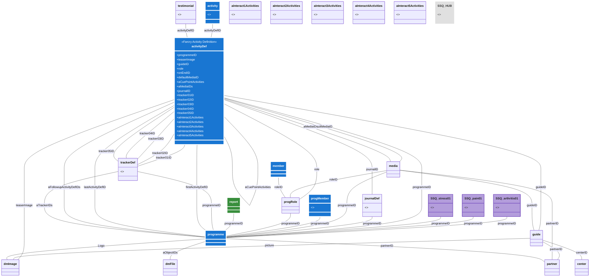

```mermaid
classDiagram
    class activity
    activity : <<Activity Instance>>
    class programme
    class dmImage
    class guide
    class progRole
    class media
    class journalDef
    journalDef : <<Journal Definition>>
    class trackerDef
    trackerDef : <<Tracker Definition>>
    class partner
    class center
    class member
    class progMember
    progMember : <<Program Member>>
    class dmFile
    class report
    class testimonial
    testimonial : <<Testimonial Instance>>
    class activityDef {
        <<Farcry Activity Definition>>
        %% Core Properties %%
        +programmeID
        +teaserImage
        +guideID
        +role
        +onEndID
        +defaultMediaID
        +aCuePointActivities
        +aMediaIDs
        +journalID
        %% Tracker IDs %%
        +tracker01ID
        +tracker02ID
        +tracker03ID
        +tracker04ID
        +tracker05ID
        %% Interact Activities %%
        +aInteract1Activities
        +aInteract2Activities
        +aInteract3Activities
        +aInteract4Activities
        +aInteract5Activities
    }
    class aInteract1Activities
    aInteract1Activities : <<Interact 1 Activities>>
    class aInteract2Activities
    aInteract2Activities : <<Interact 2 Activities>>
    class aInteract3Activities
    aInteract3Activities : <<Interact 3 Activities>>
    class aInteract4Activities
    aInteract4Activities : <<Interact 4 Activities>>
    class aInteract5Activities
    aInteract5Activities : <<Interact 5 Activities>>
    class SSQ_HUB
    SSQ_HUB : <<SSQ Hub>>
    class SSQ_arthritis01
    SSQ_arthritis01 : <<SSQ_arthritis01>>
    class SSQ_pain01
    SSQ_pain01 : <<SSQ_pain01>>
    class SSQ_stress01
    SSQ_stress01 : <<SSQ_stress01>>
    %% Tracker ID Relationships %%
    activityDef -- trackerDef : tracker01ID
    activityDef -- trackerDef : tracker02ID
    activityDef -- trackerDef : tracker03ID
    activityDef -- trackerDef : tracker04ID
    activityDef -- trackerDef : tracker05ID
    %% Interact Activity Relationships %%
    activityDef -- activityDef : aInteract1Activities
    activityDef -- activityDef : aInteract2Activities
    activityDef -- activityDef : aInteract3Activities
    activityDef -- activityDef : aInteract4Activities
    activityDef -- activityDef : aInteract5Activities
    %% SSQ Relationships %%
    SSQ_arthritis01 -- programme : programmeID
    SSQ_pain01 -- programme : programmeID
    SSQ_stress01 -- programme : programmeID
    activity -- activityDef : activityDefID
    activityDef -- programme : programmeID
    activityDef -- dmImage : teaserImage
    activityDef -- guide : guideID
    activityDef -- progRole : role
    activityDef -- activityDef : onEndID
    activityDef -- media : defaultMediaID
    activityDef -- activityDef : aCuePointActivities
    activityDef -- media : aMediaIDs
    activityDef -- journalDef : journalID
    guide -- dmImage : picture
    guide -- partner : partnerID
    guide -- center : centerID
    journalDef -- programme : programmeID
    media -- guide : guideID
    media -- partner : partnerID
    media -- programme : programmeID
    media -- progRole : roleID
    member -- progRole : roleID
    progMember -- programme : programmeID
    programme -- partner : partnerID
    programme -- dmImage : Logo
    programme -- activityDef : firstActivityDefID
    programme -- activityDef : lastActivityDefID
    programme -- activityDef : aFollowupActivityDefIDs
    programme -- trackerDef : aTrackerIDs
    programme -- dmFile : aObjectIDs
    progRole -- programme : programmeID
    report -- programme : programmeID
    testimonial -- activityDef : activityDefID
    trackerDef -- programme : programmeID
style SSQ_HUB fill:#e0e0e0,stroke:#bdbdbd,stroke-width:0px,color:#333
style member fill:#1976d2,stroke:#fff,stroke-width:4px,color:#fff
style progMember fill:#1976d2,stroke:#fff,stroke-width:4px,color:#fff
style activity fill:#1976d2,stroke:#fff,stroke-width:4px,color:#fff
style activityDef fill:#1976d2,stroke:#fff,stroke-width:4px,color:#fff
style programme fill:#1976d2,stroke:#fff,stroke-width:4px,color:#fff
style journal fill:#1976d2,stroke:#fff,stroke-width:4px,color:#fff
style tracker fill:#43a047,stroke:#fff,stroke-width:4px,color:#fff
style report fill:#388e3c,stroke:#fff,stroke-width:3px,color:#fff
style moduleDef fill:#388e3c,stroke:#fff,stroke-width:3px,color:#fff
style module fill:#388e3c,stroke:#fff,stroke-width:3px,color:#fff
style SSQ_arthritis01 fill:#b39ddb,stroke:#7e57c2,stroke-width:2px,color:#222
style SSQ_pain01 fill:#b39ddb,stroke:#7e57c2,stroke-width:2px,color:#222
style SSQ_stress01 fill:#b39ddb,stroke:#7e57c2,stroke-width:2px,color:#222
```
