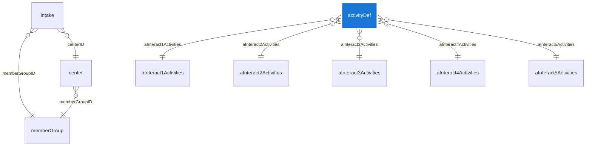

```mermaid
erDiagram
    center
    memberGroup
    intake
    %% Interact Activity Entities %%
    aInteract1Activities
    aInteract2Activities
    aInteract3Activities
    aInteract4Activities
    aInteract5Activities
    %% Interact Activity Relationships %%
    activityDef }o--|| aInteract1Activities : "aInteract1Activities"
    activityDef }o--|| aInteract2Activities : "aInteract2Activities"
    activityDef }o--|| aInteract3Activities : "aInteract3Activities"
    activityDef }o--|| aInteract4Activities : "aInteract4Activities"
    activityDef }o--|| aInteract5Activities : "aInteract5Activities"
    center }o--|| memberGroup : "memberGroupID"
    intake }o--|| memberGroup : "memberGroupID"
    intake }o--|| center : "centerID"
style SSQ_HUB fill:#e0e0e0,stroke:#bdbdbd,stroke-width:0px,color:#333
style member fill:#1976d2,stroke:#fff,stroke-width:4px,color:#fff
style progMember fill:#1976d2,stroke:#fff,stroke-width:4px,color:#fff
style activity fill:#1976d2,stroke:#fff,stroke-width:4px,color:#fff
style activityDef fill:#1976d2,stroke:#fff,stroke-width:4px,color:#fff
style programme fill:#1976d2,stroke:#fff,stroke-width:4px,color:#fff
style journal fill:#1976d2,stroke:#fff,stroke-width:4px,color:#fff
style tracker fill:#43a047,stroke:#fff,stroke-width:4px,color:#fff
style report fill:#388e3c,stroke:#fff,stroke-width:3px,color:#fff
style moduleDef fill:#388e3c,stroke:#fff,stroke-width:3px,color:#fff
style module fill:#388e3c,stroke:#fff,stroke-width:3px,color:#fff
style SSQ_arthritis01 fill:#b39ddb,stroke:#7e57c2,stroke-width:2px,color:#222
style SSQ_pain01 fill:#b39ddb,stroke:#7e57c2,stroke-width:2px,color:#222
style SSQ_stress01 fill:#b39ddb,stroke:#7e57c2,stroke-width:2px,color:#222
```
